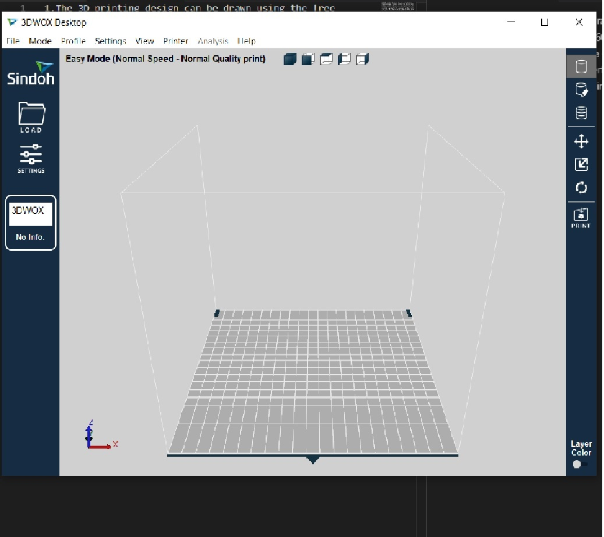
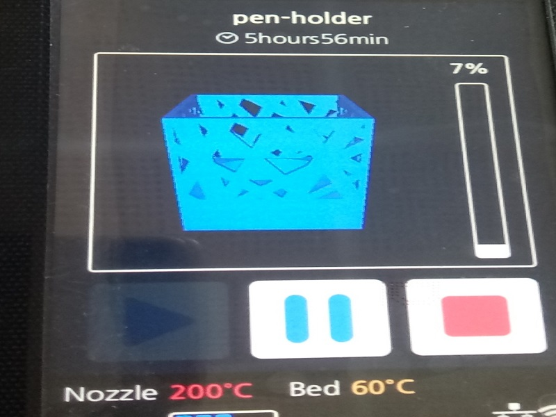

1.The 3D printing design can be drawn using the free  Freecad software, Tinkerecad and for the  advance level Fusion360 ,Blender 2.8 etc.  
2. After creating a 3d image or the downloading the 3d image from freely availabe online this files needs to be converted to g-code file for sending it to 3DWox printer. This printer wifi enabled and printing can be done using the software application provided by the manufacture.
.
3. OR even the print can given loading the g-code file on the usb memory drive and the print can be issued from the control pannel of the 3d printer. 

4.This printer uses the polylactic cartridge and single colour can be used at a time and it is having the thickness of 1.75 mm in diameter and 700 grms per cartridge.

5.Few tips on the proper use of the printer that the filament should be tightly wound. 
6. While rewinding the filament should not stressed beyound the plastic limit of the filament it is likely get cut before feeding inside the printer.  
7. While loading the cartridge, the loose ends of the filament should not extrude from the opening of cartridge. After new filament cartridge is fitted manually inside the printer, the feed new cartridge command can be assessed by selecting the Cartridge menu on LCD screen available in the printer.  
8. Each of the cartridge comes with with its electronic chip/pcb kit which has all its filaments details in it required for the printer during printing.  
9. Already loaded filaments needed to be removed that first the nozzle to be heated to loosen the filament using the Extrude command from the control planel on the printer.  

 