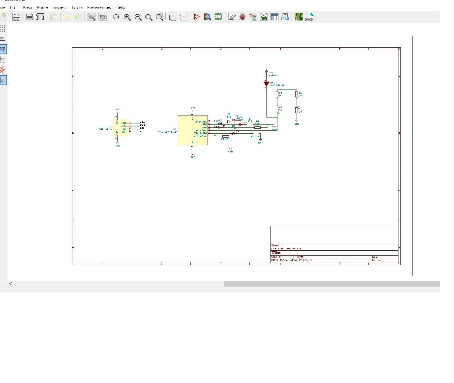
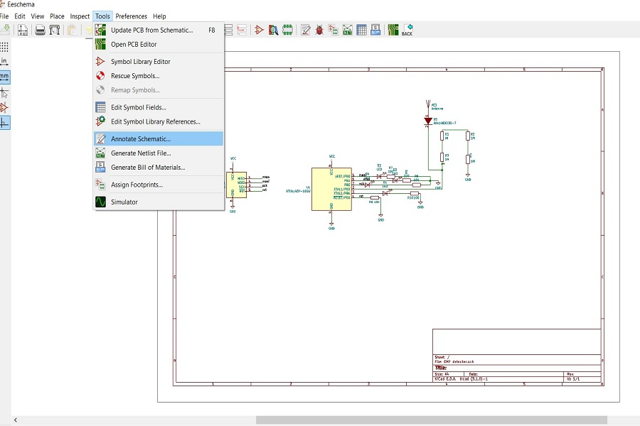
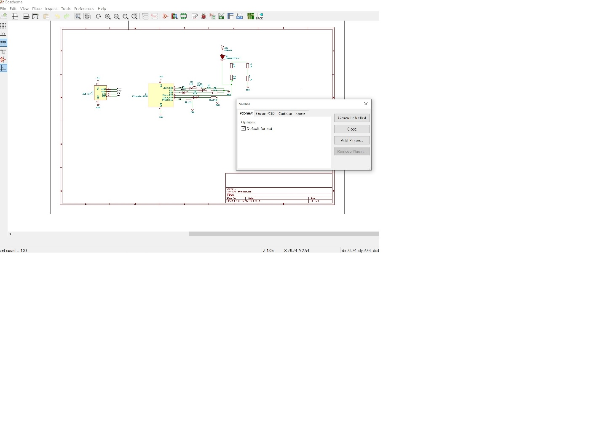
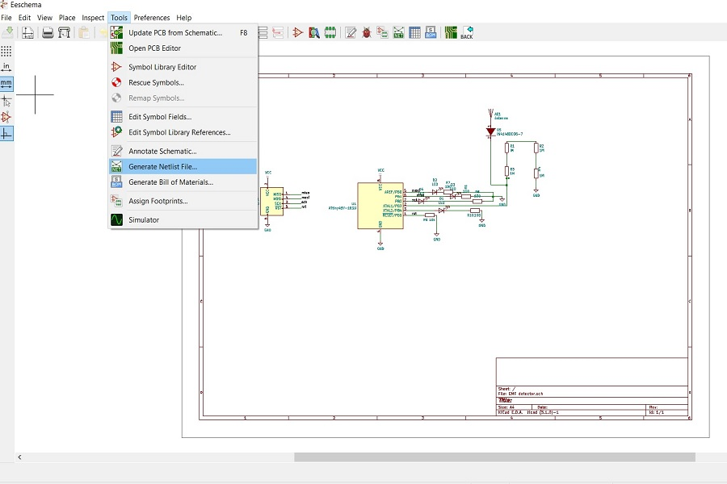
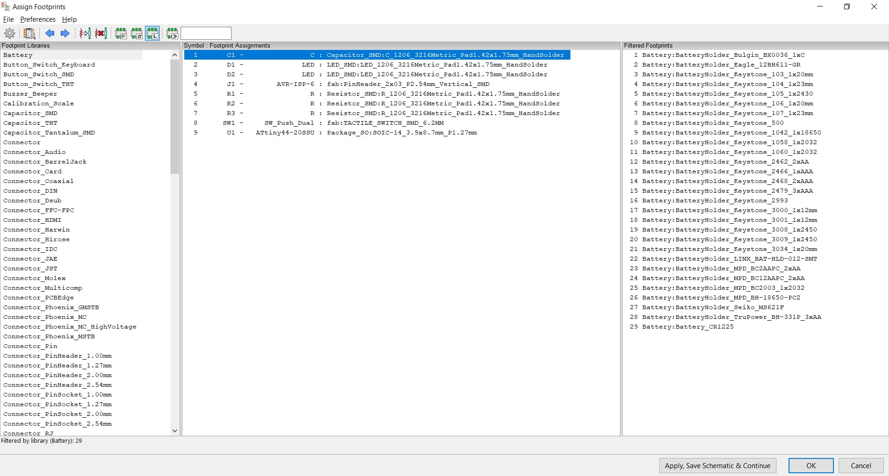
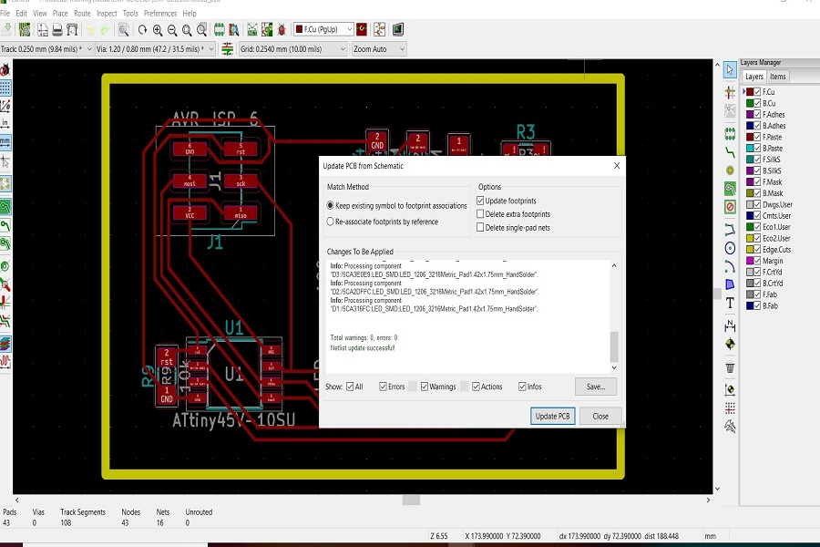
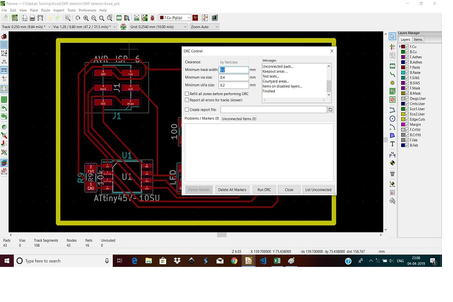
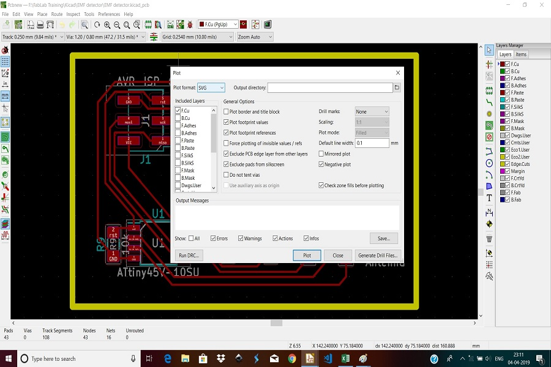

   # Project EMF Detector using ATTINY45 Micro controller 
    
   * About EMF Detector :- EMF (Electromagnetic field) occurs naturally and also come from manmade sources. Scientific studies suggest that electic and magnetic fields are unlikely to be harmful at the level normally found in homes,although there is some uncertainty regarding certain health effects. 
   Also it found that certain device do get influence and their performance is effected because of the electromagnetic field is need them, like the data cable are running parallel to the power cable with high electro magnetic field around it so result in  reduce the signal strength of that data cable cause signal disturbance. 
   Also if the cable carrying audio signal is running paralled power cable or passing near buy high power electrical device this may case audio signal to capture the humming sound at the output speaker and result is noise and humming sound at the output at Audio system.  
   * Hence it becomes necessary to detect and measure the Electromagetic feild near by such electronic systems which are sensative to the emf during operation . So such electronic systems can be  isolated from the emf near by for their proper function. So here we have designed and produced the EMF detector using the ATTINY45 micro controller and tested it. 
   # The below steps were performed by us for the design and producing the EMF detector using the ATTINY45 micro controller as listed below.  
   * Design the  electronic circuit on the  paper sheet with the components specifcations on it from input to output and power supply and ground etc. 
   * The using the KICAD application the fallowing process were undertaken from starting from the circuit layout to final plotting of the circuit design to be ready to milling of the PCB as listed below along with pictures for ready reference :- 

   # EMF Detector circuit layout using Kicad   
   
# Annonate Schematic.  
   
 # Net list & Generate Net List  
 
 
 #  Foot Print 
   
 # Update PCB to Schematic
   
 # Design Rule Checker 
    
# Plot the circuit 
  
 # 

 
 

   

