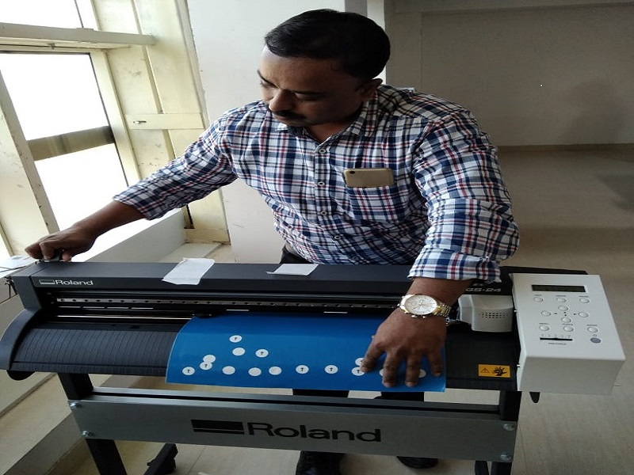

 ROLAND CAMN-iGS -24  
 
  

 This is the 2D cutter which can cut the vinyl roll and make stickers and drwaring or image printed out and using freeware software like Inkscape or GIMP. The already grahpic image can be opened into Inkscape or a new drawing can be designed in the Linkscpae. 
 * Procedure and guidlines for cutting a sticker on the Roland CAMN-iGS-24 as given below. 
 1. Open a new template in the inkscape 
 2. We need to set margin serach for various options in the drop box and select generic canvas then set the width to 150 and height to 50 an create new template.
 3. The set margin will appear on the scree and then select A option in the left side and type the content you want to type.
 4. Then proporstionately align the typed content in the margin which is already set by click the arrow symbol in the top left side of the screen. 
 5. Then export the PNG image at left side and option table will popup and select the page as already the x & Y are already set now set the image setting like pixel size to 600 dpi. 
 6. Now export the PNG file to pre decided local folder on your PC. 
 7. Now open the site www.fabmodules.org 
 8. Imput format on the site select the image (.pmg) and select the path on your PC the select the respective format and create the output file by selecting Roland vinly(.camm) set the force to 80 g  and velocity 20cm/s and the origin left bot right and then process and save the output file. here its is bitmap.png file and now ready to be printed on the vinly cutter. 
 9. Now load the vinyl roller in the cutter by unlocking the gear/hamdle and place the roll tray begind and there two supporting roller in the front place it properly so that optimum area of the vinly sheet as be usable. 
 10. The sheet should be parallel to the line in the alligment lines provided at the front side. 
 11. Now the sticker or drawing can be cut on the Vinyl cutter. 
 