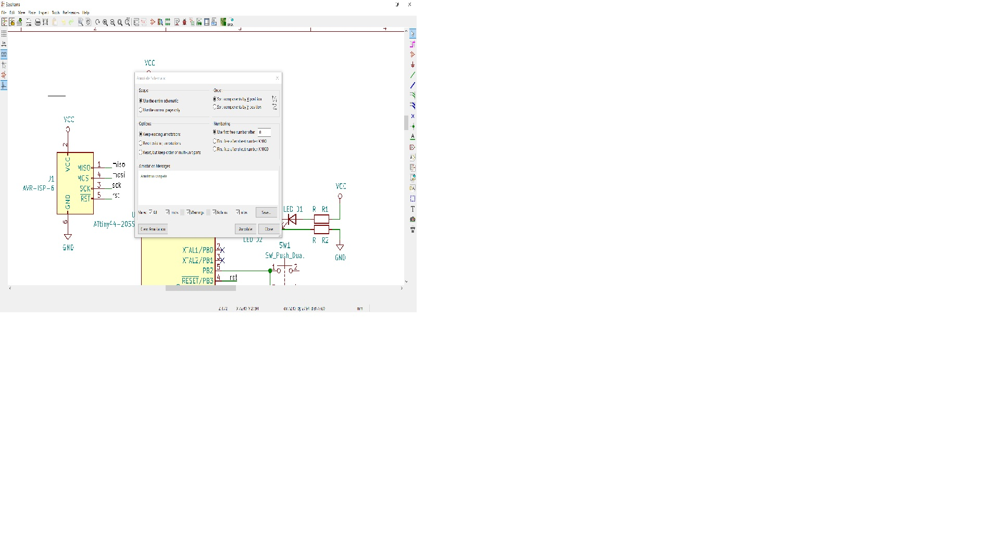
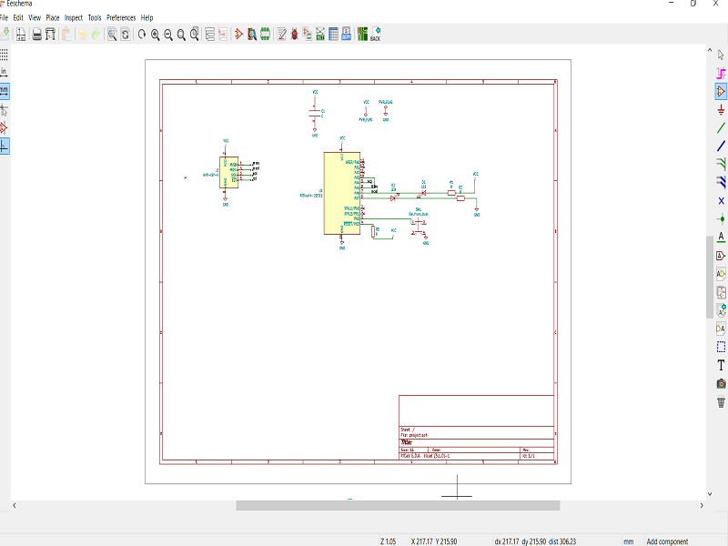
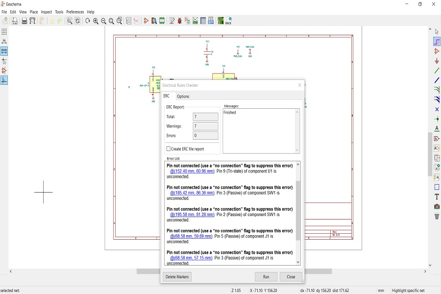

# Handons details of design and printing of the PCB using the Roland Mono Fab SRM 20. 
* This machine can mill following materials :-  
PC Board  
Acrylic  
Polyacetale  
ABS  
Chemical wood  
Foam  
Modeling wax  
* For the design ,editing ,scalling and milling fallowing application software can be used , few are listed below:-  
SRP Player and Modela Player 4  
ClickMill  
SF Edit 2  
# The step by step procedure for the PCB design using KiCAD as given below :-  
1. Open the Kicad application and open the file select the new schematic layout editor.  
2. Now when the schematic layout is open in it open the component and add the components as per the library available in the popup , this popup will be open when the cursor is double right click.  
3. .When all the components are placed on the grid label them with respective symbolic names , please note if similar components are repeated one can be duplicated and pasted as per the circuit diagram.  
4. The components after placing the layout sheet can be connected with wires button available at the right hand side . The components using the cursor can be interconnected by selecting connector soft button then press W to start the connection and K to end connection to the respective connector. 
5. To move tthe component place cursor on the component and press G. To rotate the component place cursor on the component and press R.To duplicate the component place cursor on the component and press D.To delete the the component place cursor on the component and press Del. 
6. Attach the PWR_FAG to Vcc and GND.  

7. Were ever the pins are not used assign a " no connect " symbol for the unused pins of the IC.  

* Annotation or Naming  

  

8.Use the default values for the annotation schematic symbol tool and to edit the value on the component move the cursor over the component and press E.And to write a local name use ' Place Net Lable '.  

9. 
10 Run Electrical rules check as show below  and resolve the errors notfied after the elecrical check.

  

11. Generate net list by using the icon " Generate Net List " with default values.  
12. Assign the PCB Foot print to the schematic symbols.  
13. 

 

