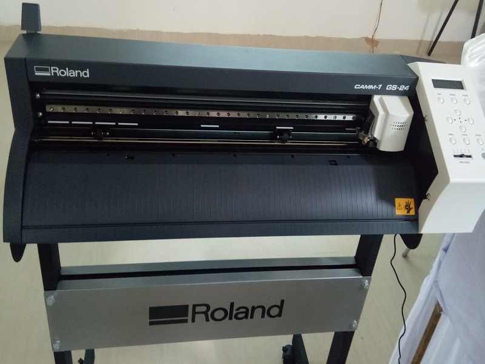
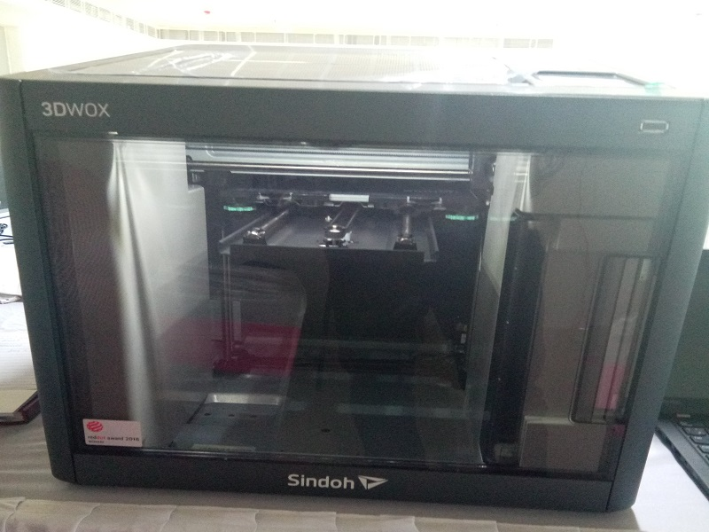
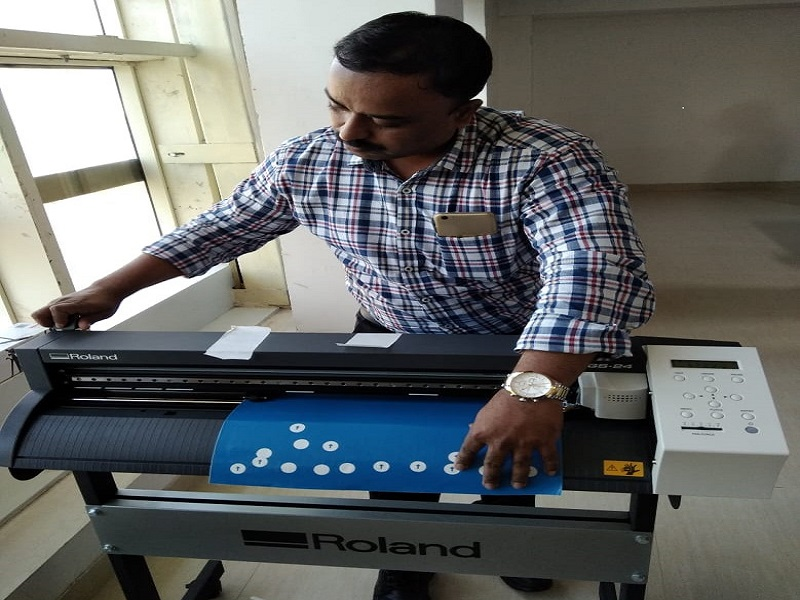

# Hemant Rawade
# About
I am working in STPI as Asst Director and had worked in Datacom Group and handle the installation of (IPLC) International Private Lease Circuits satelite links on C-Band and V- Sat, Fibermux like Mainstreet,Point to multipoint radio links, NOC instalation and shifting of ( Network Operation Center) & Radio repeater etc. Have worked as Management Representative for ISO 9001:2000 acceradion and is certified interal auditor for ISO 9001:2000.

# About Fablab training program known as FABZERO.

Being given the apportunity to getting the Fab-Lab Pre-Acadmey program called as Fabzero. This training was scheduled from 18/3/2019 to 5/4/2019 at STPI Bhubneshwar .
This Pre-Acadmey program was launched by Shri Onkar Rai Sir, Director General STPI through VC from STPI HQ and addressed all participaints that how Fablab is one of the efforts apart many other initiatives taken by STPI to make our nation a " Product Nation".

# What is Fabzero program

* This programs are not a traditional but a distributed education system with mentors instead of teachers. It works on the basic principle that is Learn + make + share. Based in the Scientific method. That means the student learns and have handson and documents their experience through a personal portfolio.
* It has the three level of assessment that self assessment then local evaluation and finaly the global evaluation prosess.
* My mentor is Mr. Francisco & Mr. Sibu 

# Training Experience 
* Our Mentor Mr. Francusco introduced about the Fablab foundation USA and Fabzero program and further asked us to installed various application as given below to operate through the Window bases operating system. But share that its prefered that the Linux based operating system are more system freedly and relaible than other operationg system. 

* Documenting the experience on online repository at Github 

-Open "New Window" in visual Studio Code
--Copy the clone Address from Github

---This is the command to see the clone address at Github "Control + Shift + P" 

---Clone address will pop up.Copy and Paste in Visual Studio Code at "Git: Clone" 

----Imstall windows GIT and then GIT Bash will also be installed and now open GIT Bash. 
 
 * Windons screen view as see in windows

 
HEMANT@LAPTOP-338HDE0D MINGW64 ~

$ git config --global user.name Hemant747

HEMANT@LAPTOP-338HDE0D MINGW64 ~

$ git config --global user.email 

HEMANT@LAPTOP-338HDE0D MINGW64 ~

$ git config --global user.email

* Fallowing other softwares were also installed as given below :-
*Code Spell checker in Visual Studio Editor ( for docum*entation & repository update)
*Inkscape. (2D drawing)
*Ultimate Cura. (3D drawing )
*Kicad ( Electronic PCB designing)
*Freecad.( 3D drawing)
*Sindoh 3d Wox printer

# First Visit to the Fablab setup #

We visited the Fab lab setup and observred that various fabrication machine were installed in the lab
First we have seen the Laser cutter machine which using the class 4 laser light.
The machine uses various material for cutting first the rolls of copper , 
Anotther machine which is used to throughout the hotair and fumes and smoke was installed which has various filter and fine particale filter like the carbone filter
We have seen 3d printer for the electronic PCB cutting along with desoldering machine which is used to remove the components and has three switched
like on ,off, cool and it should not be switched off directly.
One soldering machine along with a devices which will having the lead filter to protect from inhalling the harmfull fumes.
WE have seen a 3d printer which uses the sun light for cutting the resin at very fine size cutting .
Another 3d printer with non resign and have two different cleaning device machine the backet or the holder.
There are also 2D printer 
In the another se

Was able to upload three images and the steps are
Get the pic and resize it to 800 and 600 and save with the meaningfull name on the local folder
In the fabzero at the visual studio code editor creat a folder called as img 
please note to keep in lower case to avoid the confusion and conflict at the window based
Now cut and paste the image from the local folder to the newly created folder om the VS editor
In the vS editor page type the syntax 
After this go to the symbol share where you will see a count of the image/file selected click it
Then a new symbol called correct is visible click it
Then popup will some asked to save all with three other option
The again save
Give the comment in the VS editor
Enter 
Check the update on the github profile and see the updat
Now wish to upload the details of the Vinlycutter

